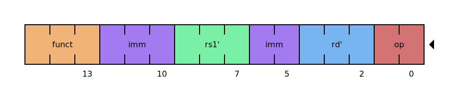
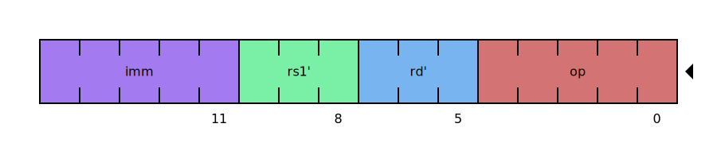
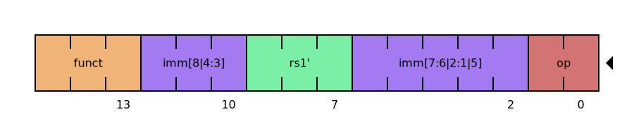
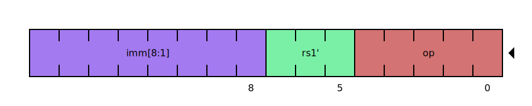
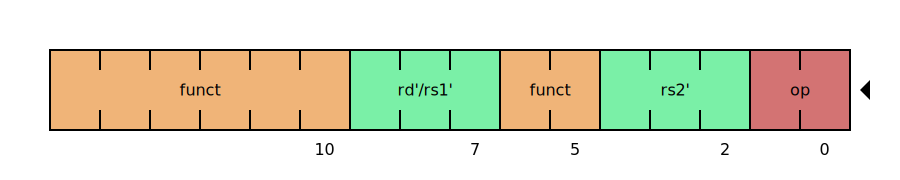
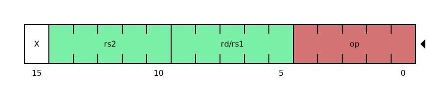

# Embive Transpiler

Embive employs a transpiler to convert native RISC-V bytecode into an optimized format designed for software interpretation.  

Although transpilation can be executed directly on the target device, the Embive format's stability and determinism allow ahead-of-time (AOT) conversion on a separate system (e.g., a backend server). By preprocessing the bytecode before deployment, the host application (such as firmware) benefits from a reduced binary size and faster startup.

## Optimizations
RISC-V instructions were designed for hardware simplicity, making it inefficient to directly interpret them in software. The Embive format addresses this through several key optimizations:

1. **Opcode and Function Merging**  
RISC-V instructions often share opcodes, relying on function fields to distinguish between them. These fields may be split to simplify hardware decoding. Embive combines opcodes and function fields into a single unified value, reducing the number of comparisons needed during interpretation. Here is an example:  
**RISC-V**

**Embive**

2. **Immediate Value Reordering**  
RISC-V immediate values are encoded with bit ordering optimized for hardware decoding, minimizing circuit complexity by reusing logic across instructions. However, this design complicates software interpretation by requiring additional steps to extract immediate values. Embive reorders these bits into a more straightforward layout, reducing interpretation overhead. Here is an example:  
**RISC-V**

**Embive**

3. **Sequential Instruction Encoding**  
Standard RISC-V encodings leave gaps between instruction opcodes, especially in smaller ISAs or those without extensions. Embive reassigns merged opcodes sequentially, ensuring a compact encoding that uses the fewest bits necessary. Here is an example:

| Instruction | RISC-V Opcode | RISC-V Function | Embive Opcode | Embive Function |
|-------------|---------------|-----------------|---------------|-----------------|
| C.ADDI4SPN  | 00            | 000             | 00000         |                 |
| C.LW        | 00            | 010             | 00001         |                 |
| ...         | ...           | ...             | ...           | ...             |
| C.SWSP      | 10            | 110             | 10110         |                 |
| AUIPC       | 0010111       |                 | 10111         |                 |
| BEQ         | 1100011       | 000             | 11000         | 000             |
| BNE         | 1100011       | 001             | 11000         | 001             |
| ...         | ...           | ...             | ...           | ...             |
| BGEU        | 1100011       | 111             | 11000         | 101             |
| JAL         | 1101111       |                 | 11001         |                 |
| ...         | ...           | ...             | ...           | ...             |
| CSRRCI      | 1110011       | 111             | 11111         | 110             |

4. **Compressed Registers Expansion**  
Compressed RISC-V instructions (C extension) use 3-bit register indexes due to space constraints, requiring expansion during decoding. Embive statically expands these registers wherever possible, reserving compressed indexes only where necessary. This optimization is feasible thanks to space savings from the previous steps. Here is an example:  
**RISC-V**

**Embive**

## Stability & Backward Compatibility
The Embive format has been rigorously tested and is considered stable. If issues in the future necessitate changes, the library’s major version will be incremented, and migration tools will be provided whenever possible.
